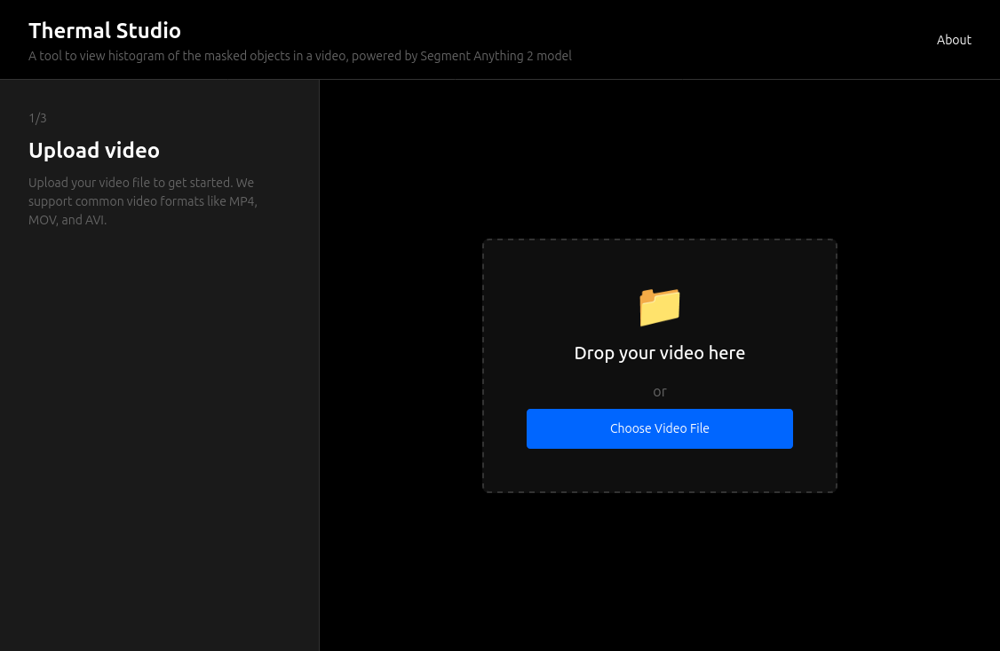
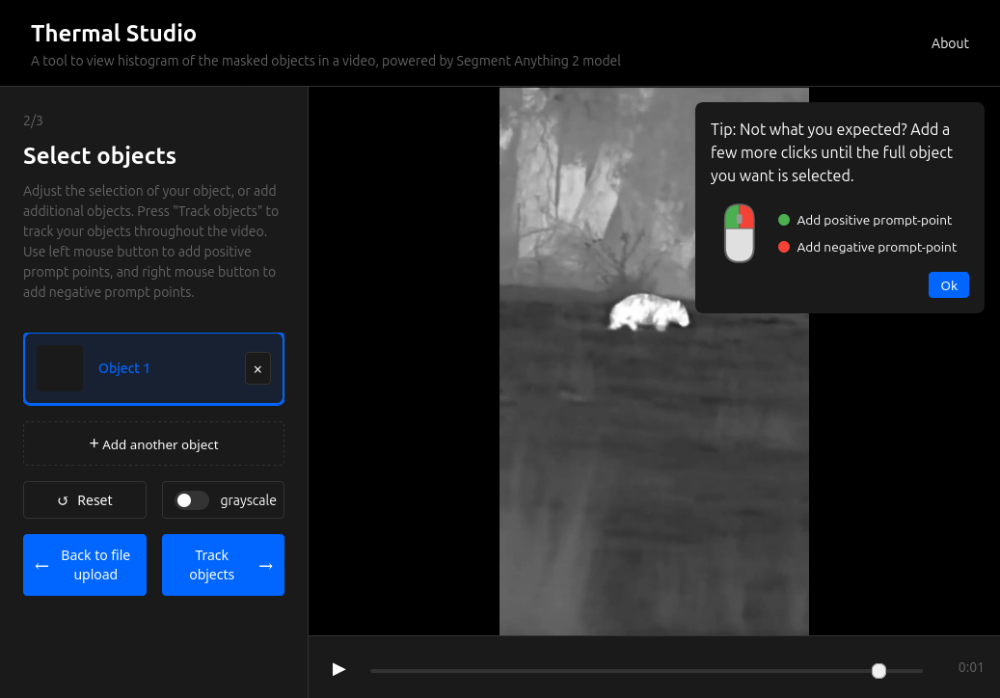
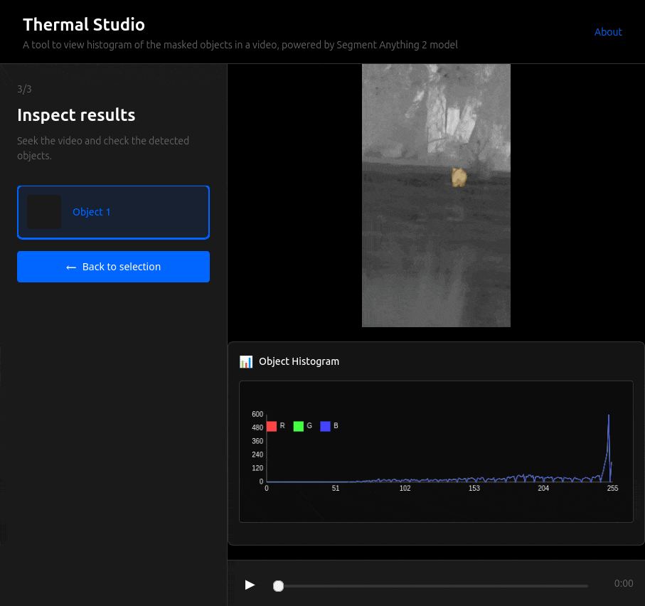

# Thermal Studio

Thermal Studio is a tool for processing and analyzing thermal camera recordings. It provides an intuitive interface for uploading thermal images, tracking object masks, and viewing thermal data per object.

## Screenshots

### Landing Page


### Setup Page


### Results Page


## Prerequisites

- Python 3.8 or higher
- NVIDIA GPU with CUDA support
- Docker (for containerized deployment)
- NVIDIA Container Toolkit (for Docker GPU support)

## Local Development Setup

1. Clone the repository:
```bash
git clone <repository-url>
cd thermal_studio
```

2. Create and activate a virtual environment:
```bash
python -m venv venv
source venv/bin/activate  # On Linux/Mac
# or
.\venv\Scripts\activate  # On Windows
```

3. Install dependencies:
```bash
pip install -r requirements.txt
```

4. Run the application:
```bash
python src/backend/server.py
```

The application will be available at `http://localhost:8080`

## Docker Deployment

1. Build the Docker image:
```bash
docker build -t thermal-studio .
```

2. Run the container with NVIDIA runtime:
```bash
docker run --runtime=nvidia \
  -p 8080:8080 \
  --gpus all \
  thermal-studio
```

The application will be available at `http://localhost:8080`

## Features

- Thermal recording upload
- Easy masking of objects using SAM2 model
- Multiple objects can be selected and processed simultaneously
- Histogram calculation and visualization of temperature distribution per object

## License

[Add your license information here] 